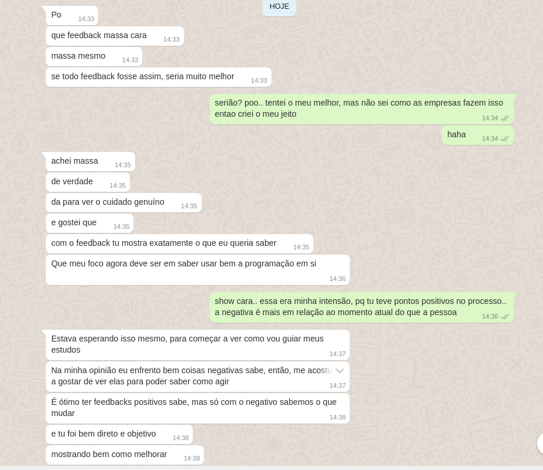

Title: Um Próspero candidato
Date: 2021-06-30 18:00
Slug: um-prospero-candidato
Author: daniellbastos
Tags: pensamentos
Og_image: static/img/um-prospero-candidato.jpg


Recentemente em um pocesso de recrutamento em que participei, abrimos seleção para o cargo de desenvolvedor backend Python. Inicialmente olhávamos para os candidatos sênior, estávamos dispostos a "pagar o preço".  
Porém, poucos nomes apareceram. Cada um em contextos diferentes, o que acabou por impedir que o "negócio" fosse fechado.

Admito, de antemão, que não tenho experiência em "estar do outro lado da mesa". Poucas vezes fui responsável por trazer talentos e gerir equipes. Agora, como desenvolvedor backend, essa luta por desenvolvedores (sim, dá vontade de sair no tapa) caiu no meu colo. **E eu gostei do desafio!**

Tenho muitos amigos e conhecidos que estão na área de programação, se capacitando e buscando trabalhar em lugares com desafios técnicos interessantes e em empresas legais. Empresas onde a relação humana seja algo valorizado.

Inicialmente, subestimei o desafio. Achei que conseguiria atingir meu objetivo rapidamente.  
*- Sabe de nada inocente!*  
Pensava isso toda noite antes de dormir, enquanto me deparava com o fato de ainda não termos o nome para a vaga.

## A tempestade de água fria

Conversando com amigos e desconhecidos que estão do "mesmo lado da mesa" (sim, eu incomodo até os estranhos), recebi aquele balde de água fria que, com muito esforço, tentava negar para mim mesmo: **É "impossível" contratar devs sênior no Brasil.**

O "*impossível*" é uma generalização, e toda generalização é burra. Mas, nesse caso, o fato de faltar desenvolvedor no Brasil é um exemplo de generalização que simplifica a comunicação com o contratante: "Precisamos de pessoal qualificado! E tá difícil!"  
Então aqueles que estão dispostos a entender, entenderão. Já aqueles que não querem entender... Bom, não estou escrevendo para eles.

## Se estiver perdendo a partida, não mude as peças do jogo. Mude as regras do jogo!

Reportei a difícil notícia ao pessoal da empresa. Daí surgiu a frase que mudou a minha percepção do problema atual:

```
Queremos ter uma equipe "classe A", isso não
se resume apenas a pessoas experiêntes.
Podemos ter pessoas "classe A" que ainda são
júnior, desde que tenham um diferencial.
```
Eureca! É isso! **Vamos mudar as regras do jogo!**

Divulguei a vaga em todos lugares possíveis e fiz questão de **não especificar** se a vaga era para júnior/pleno/sênior. Logo recebemos uma porção de currículos, dos mais diversos níveis e perfis.

Dando uma *olhadela* nos perfis que apareceram, reportei a minha impressão de cada um dos candidatos para empresa e chegamos em alguns nomes. Alguns desses nomes com uma certa desconfiança por parte da empresa, pelo fato do candidato ter pouca experiência.  
Pedi para confiarem na minha posição quanto aos requisitos técnicos: **Deixa que esse problema é meu. Se a pessoa não for boa, o primeiro a ser incomodado será eu.**

## O Próspero candidato

Conversamos com os candidatos selecionados nessa primeira fase de análise de perfil/CV. E rapidamente percebi que tínhamos um candidato com um diferencial... E não era um diferencial técnico.

Esse candidato soube se portar na entrevista. Levou a conversa com leveza e soube **expor nos mínimos detalhes a sua curta trajetória como programador**. Falou um pouco do seu lado pessoal, pelo menos aquilo que era pertinente à uma entrevista de emprego. Nos deixando conhecer um pouco mais da pessoa com quem poderíamos vir a tratar no dia-a-dia do trabalho, caso essa pessoa fosse a selecionada.

**E era isso que queríamos ouvir!**

Nosso foco é **ter gente boa do nosso lado** e só saberemos isso se o entrevistado conseguir expor, de forma coerente, o seu lado pessoal e profssional. 

Esse candidato falou tudo aquilo que o encantara na área de programação e o motivo pelo qual embarcou nessa nova empreitada.  
Ao contrário do que se possa imaginar, não buscamos o "*geniozinho*" que escovam bits, buscamos o tipo de pessoa que convidaríamos para ir ao bar tomar uma cerveja e conversar (pelo menos esse era um dos meus critérios hehehe).

Os detalhes técnicos eu tenho certeza que consigo passar ao candidato no dia-a-dia do trabalho. Já uma comunicação mais fluida e clara, é algo muito mais sutil e difícil de se ensinar.

## A parte mais difícil

Então, chegou a hora de dar a resposta aos candidatos. Ooooo tarefa difícil.

Tento me colocar no lugar do candidato, sei como é estar "*daquele lado da mesa*". Ao mesmo tempo, não posso ignorar o "*meu lado da mesa*".  
Realmente, eu gostaria de ter o maior número de pessoas interessantes trabalhando comigo. Mas antes de tudo, preciso saber se nesse momento a pessoa da "*match*" com o nosso contexto atual.  
Muitos dos meus amigos estão em "*outro nível*", a relação deles não é "*funcionário <> empresa*", mas "*prestador de serviço <> cliente*". E esse é um cenário que **não da "*match*"!**.

Precisei equilibrar tudo isso na "*balança dos candidatos*".

Além disso, tem pessoas que estão dispostas a "*vestir a camisa da empresa*" (*não gosto disso, provavelmente isso daria um novo post*), mas ainda estão no início da sua jornada.
Em uma empresa com poucos devs, preciso sopesar a decisão sem deixar o "*emocional se sobrepor ao racional*" (*existem muitas falhas nessa afirmação, mas é o melhor exemplo que encontrei*). 

A decisção do **sim** foi fácil, realmente foi fácil. Ao sair da entrevista já sabíamos que o candidato tinha aquilo que procurávamos.

Porém o **não** foi extremamente difícil de dizer. Tínhamos candidatos com muito potencial, mas não tínhamos estrutura para recebê-los. Havia outros com potencial técnico claro, mas não sabíamos até que ponto o nervosismo da entrevista o havia atrapalhado para expor a sua "pessoa"... Sem saber o que esperar da "pessoa" do candidato, seu nome acabou ficando de lado nesse primeiro momento.

## O maior desafio: o feedback

Essa foi a primeira vez que, estando "*desse lado da mesa*", precisaria reportar aos candidatos que não foram escolhidos, os motivos que nos levaram a deixá-los de fora.

É uma tarefa muito difícil! Precisei tomar muito cuidado para não analisar os testes dos candidatos com um viés estritamente técnico. Fazendo isso, desconsideraria todo o esforço realizado de candidato, principalmente aqueles que estão començando agora.

Mas todo feedback tem que agregar alguma coisa para a pessoa. Então fiz um trabalho de code-review para cada desafio que foi enviado, anotando, "linha a linha" os pontos negativos e positivos.  
Inicialmente achei que isso bastaria. Depois conversando com outras pessoas, achei melhor dar um "peso" a cada item da lista.

O feedback começou a tomar forma. Uma forma que particularmente estava me agradando.

Como não foram apenas os critérios técnicos que consideramos na escolha do candidato, visto que a entrevista teve um peso muito grande nessa "equação".  
Achei melhor escrever uma conclusão de todos os pontos marcados no teste prático e trazer algumas percepções que tive durante a entrevista.  
Acredito que assim, a pessoa que recebesse o feedback, teria mais informações em mãos para analisar seus pontos fortes e fracos.

Admito que queimei muito fosfato para por em palavras todos os critérios objetivos e nuances que levamos em consideração de **cada um dos candidatos**.

Mas tenho a certeza que esse era um esforço que todos mereciam!

Mandei por e-mail esse feedback e fiquei (e sempre vou estar) à disposição para tirar dúvidas sobre qualquer ponto do processo seletivo. E felizmente recebi esses feedbacks depois dos candidatos:





É por isso que eu sigo estudando assuntos de "humanas", sobre os sentimentos e a personalidades, para tentar me desenvolver melhor nessa área. E assim, quem sabe um dia, vou poder auxiliar os candidatos que já possuem o potencial técnico, a desenvolverem-se nessa parte "menos técnica" também, dando os melhores incentivos para que cada pessoa possa ser mais acertivo nos feedbacks.

```
PRÓSPERO –
Agora meus feitiços estão todos terminados;
Agora é por meu mérito se tenho algum poder
Que não é grande coisa, pois eu devo lhes dizer:
Preciso ficar aqui, pelos senhores confinado,
Ou parto para Nápoles. Mas, peço, não me deixem
Ficar nesta ilha nua, por vocês enfeitiçado,
Se já recuperei, de meu irmão, o meu Ducado,
Se já lhe perdoei, o usurpador; então libertem-me,
Libertem-me de minha atroz prisão ainda agora,
Com palmas, com aplauso, com as mãos tão generosas
E as cálidas palavras que das bocas vão soprar e
Meus planos vão frustrar ou minhas velas enfunar;
Tentei, sim, agradar. Os meus espíritos escravos
Agora já me faltam, e os encantos de minha Arte;
Sem eles, o meu fim é o desespero, é precisar
Das preces dos senhores: elas sabem atacar
Com sensibilidade penetrante a Compaixão
Divina, perdoando toda falha e omissão.
Assim como vocês obtêm perdão por seus pecados,
Eu posso, com as suas indulgências, ser libertado.

- A tempestade / William Shakespeare
```
