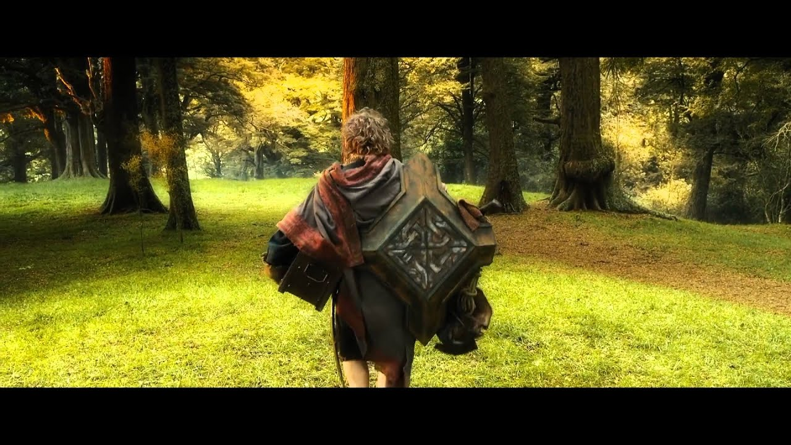

Title: Uma jornada inesperada
Date: 2023-06-19
Slug: uma-jornada-inesperada
Author: daniellbastos
Tags: pessoal
Og_image: static/img/uma-jornada-inesperada1.webp

> Sam: Se eu der mais um passo, será o mais distante de casa que jamais vim.  
> Frodo: Venha, Sam. Lembra o que o Bilbo dizia? É perigoso Frodo, sair porta afora, você pisa na Estrada e se não controlar seus pés, não há como saber até onde você poderá ser levado.

Depois que saímos do nosso Condado, onde todas pessoas são familiares e tudo é conhecido, passar o dia do aniversário longe dos pais, irmãos e amigos, é algo comum. Sempre fizemos um esforço ou outro para estarmos juntos nessas datas, para celebrar "à moda antiga".

Esse ano foi um pouco diferente do que de costume, assim como quase tudo que estamos vivendo ultimamente.
Dessa vez passamos o meu aniversário longe de toda nossa família. Na verdade, todos os aniversários da família vão ser desse jeito este ano.  
Não só estamos longe da família, como estamos o mais longe que já estivemos até agora.

Mas a vida é feita de escolhas e preferimos nós mesmos fazer as nossas escolhas, ao invés de deixar que a vida as fizessem por nós. Então ganhamos muitas coisas, e perdemos o mesmo tanto, ou mais.

E não é por isso que deixamos nossas tradições de lado. Tradição não está em lugares ou coisas, está no peito.  
Por isso seguimos com as tradições de aniversários, com bolos, velinhas, presentes, etc. E quando a família não pode estar por perto, ligamos e brindamos juntos! Conforme manda a tradição!

> Nem todos aqueles que vagueiam estão perdidos.  
> - J. R. R. Tolkien

Se eu gostaria que fosse diferente? É claro!

Gostaria que todos estivessem cá onde estávamos, experimentando as coisas que gostamos de experimentar. Mas essa foi a nossa escolha e não a deles!

Não é possível ter tudo. Escolher é decidir o que perder, para **tentar** ter àquilo que queremos.

E por mais estranho que pareça, não estou triste. Sei que há algo em mim que gostaria que tudo fosse diferente, como era antes.  
Porém ao mesmo tempo, não estou arrependido das escolhas que fizemos, por mais difícil que elas foram (e ainda estão sendo).

Sabíamos que estávamos deixando muito para trás, sem garantia alguma que daria certo.  
Mas, assim como Bilbo, dissemos sim ao chamado de viver uma jornada inesperada para além das fronteiras do Condado.

Conhecer tudo aquilo que está para além das fronteiras e entender que o Condado é o meu lugar, e está sempre comigo.

> Bilbo: Você pode promoter que eu vou voltar?  
> Gandalf: Não. E, se você voltar, não será mais o mesmo.

